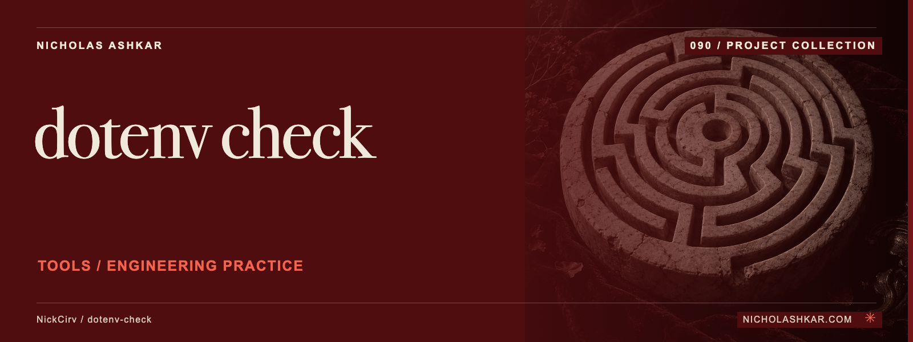

# dotenv-check

Check an environment file for missing keys, duplicates and selected formatting problems.


<a id="usage"></a>

## What it does

Compares keys with an example or --required list, supports optional-key annotations, and reports presence without printing values. --check-format enables value-shape checks; --strict makes warning statuses fail. See the pinned [implementation](https://github.com/NickCirv/dotenv-check/blob/5244998863f2a123a2631d47e1ef864bd9af6079/index.js).


<a id="install"></a>

## Quickstart

Node requirement from the inspected manifest: **`>=20`**. Use sanitized fixtures when sharing reports. A missing input file is an error; a missing example leaves only explicit requirements and local checks.

The following example is **source-inspected, not executed**. It uses a pinned checkout; npm package publication is not assumed. Replace project paths or provide the stated input fixtures before running it.

```bash
git clone https://github.com/NickCirv/dotenv-check.git
cd dotenv-check
git checkout 5244998863f2a123a2631d47e1ef864bd9af6079
npm install --ignore-scripts
node index.js --env ../your-project/.env --example ../your-project/.env.example --check-duplicates --format json
```

Dependencies are installed with lifecycle scripts disabled in this recipe. Read the package scripts before enabling any lifecycle step required by your environment.

## Usage and reference

`dotenv-check` | `envcheck` are the executable names declared by the package. [Command reference](docs/REFERENCE.md) covers source-backed options and entry points.

| Control | Behavior in the inspected implementation |
| --- | --- |
| `--env PATH` | Choose the environment file |
| `--example PATH` | Choose the reference example |
| `--required LIST` | Supply explicit required keys |
| `--check-duplicates` | Report duplicate declarations |
| `--strict` | Fail warning statuses as well as errors |

## Limits and operational notes

This parser is not a full shell or dotenv evaluator. Format findings are reported but the inspected final exit calculation uses missing/parse errors and warning statuses; do not assume every format finding fails CI. Extra means absent from the example, not unused by source code.

## Development

No runtime checks were executed for this documentation review. The committed smoke test checks entrypoint JavaScript syntax; it does not exercise the command behavior.

| Script | Declared command |
| --- | --- |
| `test` | `node --test` |

Work from the pinned source, keep changes focused, and reproduce the affected behavior with a small fixture before proposing a change. Existing contribution and security policies remain authoritative where present.

## Research and status

[Research record](docs/RESEARCH.md) identifies the inspected revision, source evidence, documentation disposition and verification gaps. Static inspection supports the descriptions here; runtime behavior, dependency installation and current hosted services remain unverified.

## License and author

[License](https://github.com/NickCirv/dotenv-check/blob/5244998863f2a123a2631d47e1ef864bd9af6079/LICENSE)

[Nicholas Ashkar](https://nicholashkar.com) · Applied AI, systems and consulting.
